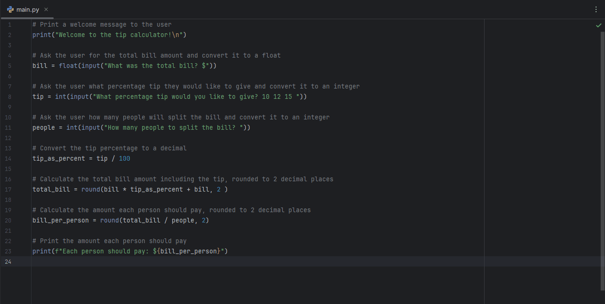

#   Day 2: Tip Calculator

### Description
A simple Python program that calculates the total bill amount including tip, and splits the bill evenly among a specified number of people.

### Technologies Used
- Python 3
- `input()`, `print()`, f-strings
- Basic arithmetic operations and user input handling

---
### How to Run
1. Clone this repository
2. Navigate to the project folder
3. Run the script:

 ```bash
   python main.py
   ```

---
### Demo


### Key Learnings
- Converting types with `float()` and `int()` for numerical input
- Performing arithmetic calculations (percentage and division)
- Rounding results to two decimal places with `round()`
- Handling user input and formatting outputs with f-strings
