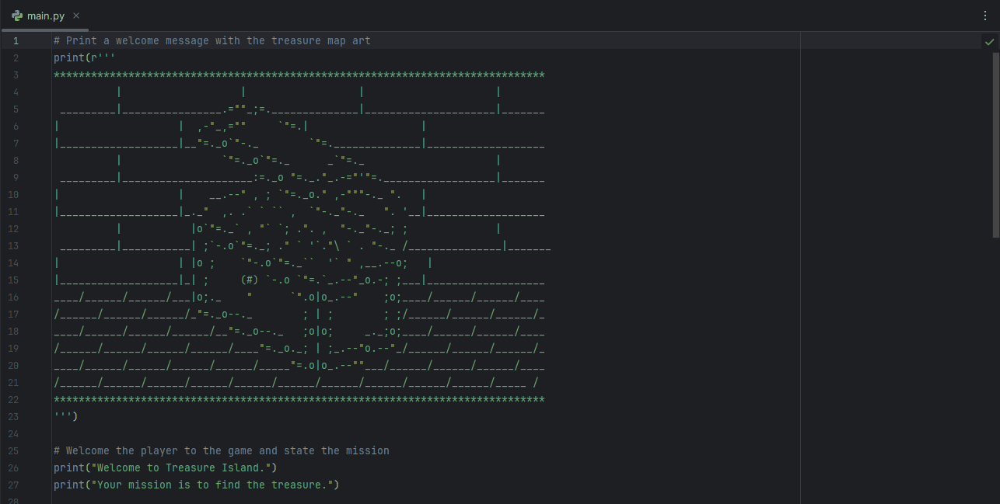

#   Day 3: Treasure Island

### Description

A simple Python adventure game where the player makes choices to find the treasure. It uses conditional statements to control the story flow.

### Technologies Used

- Python 3
- `input()`, `print()`
- Conditional statements (`if`, `elif`, `else`)

---

### How to Run

1. Clone this repository  
2. Navigate to the project folder  
3. Run the script:

 ```bash
   python main.py
   ```

---

### Demo



### Key Learnings

- Using nested conditionals to control program logic  
- Handling user input and converting it to lowercase for validation  
- Structuring interactive text-based games in Python

