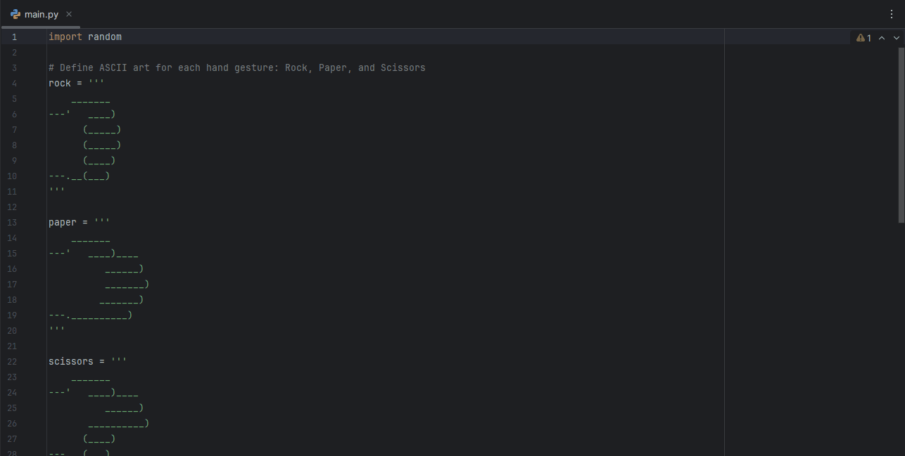

#   Day 4: Rock Paper Scissors

### Description

A simple Python program that simulates the classic game Rock-Paper-Scissors.  
The user selects an option, the computer makes a random choice, and the program determines the winner.

### Technologies Used

- Python 3
- `input()`, `print()`
- `random.randint()`
- Conditional statements (`if`, `elif`, `else`)
- Lists and ASCII Art

---

### How to Run

1. Clone this repository  
2. Navigate to the project folder  
3. Run the script:

```bash
   python main.py
   ```

---

### Demo



### Key Learnings

- Using the `random` module to generate random choices  
- Handling user input and validating ranges  
- Applying conditionals to create game logic  
- Working with lists and ASCII art to display game visuals
