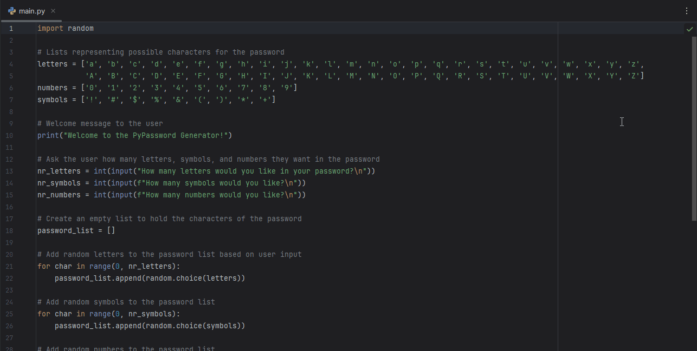

#   Day 5: Password Generator

### Description

A Python program that generates a random password based on user-defined criteria:  
number of letters, symbols, and numbers. It uses lists and `random` to create a secure password.

### Technologies Used

- Python 3  
- `input()`, `print()`  
- `random.choice()`, `random.shuffle()`  
- Loops and lists

---

### How to Run

1. Clone this repository  
2. Navigate to the project folder  
3. Run the script:

```bash
   python main.py
   ```

---

### Demo



### Key Learnings

- Using the `random` module to choose random characters and shuffle lists  
- Managing user input to customize output  
- Working with lists and loops for dynamic string construction  
- Building simple but practical tools for daily use
